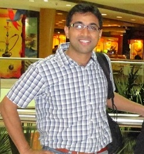

# About me

Jayant has 18+ years of work experience in design, development, implementation, testing, training and production support of software systems and applications in the field of CAD/CAE/PLM, financial services and software products.
 
Jayant has worked with various technologies, such as, C, C++, .Net, Java, SQL Server, 
Oracle, MySQL, JSP, MERN stack, Android apps, Python, AWS and Azure cloud.

He is a PMI certified Project Management Professional (PMP). He is a 
certified ScrumMaster, AWS Certified Solution Architect and has 
TOGAF 9 certification for Enterprise Architecture. He is also a 
Sun Certified Java Programmer (SCJP 1.4) wherein he had 
scored 100%.

> Jayant’s experience spans all phases of design, implementation and upgrade life cycle.

> Currently, he spends his time consulting on Cloud, data science and app developments projects, training & coaching people, young and old alike; besides traveling and writing in spare time.

> He has keen interest in aerospace technologies, medical field, design thinking and public policy in adult education.

> Jayant has completed his formal education in Aerospace Engineering. (B. Tech and M. Tech in Aerospace Engg. from IIT, Kanpur)

#### Certifications & Credentials
- UiPath RPA Developer Advanced (Code: 643374218137945661)
- Certified ScrumMaster, Certification #: 124246
- AWS Certified Solutions Architect – Associate (Scored 96%)
- Project Management Professional (PMP) from PMI – 511117
- TOGAF 9 Certified
- Sun Certified Java Programmer, SCJP 1.4 (Scored 100%)
- Six Sigma Green Belt by CSC Corp Quality, Hyderabad
- B. Tech. from IIT Kanpur
- M. Tech. from IIT Kanpur

For course enquiries, write to us at: [contactjvis@gmail.com](mailto:contactjvis@gmail.com?"Course Enquiry") 
Your feedback helps us improve. Please write your feedback to us at: [feedbackjv@gmail.com](mailto:feedbackjv@gmail.com?subject=Feedback)
